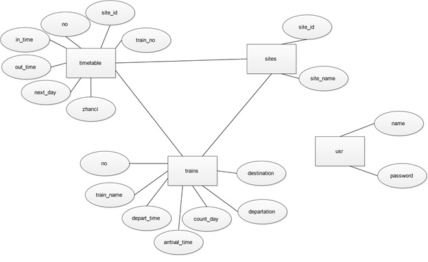
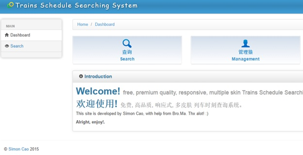
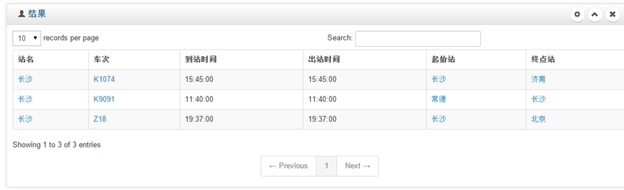
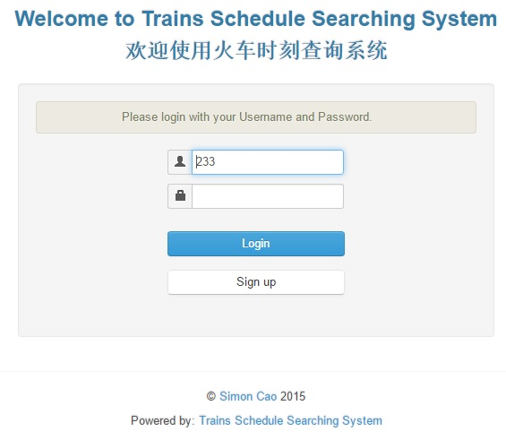
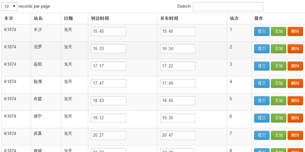
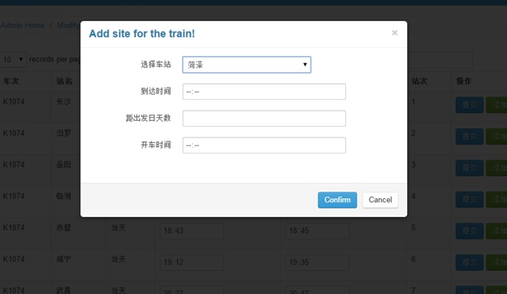

# railsys
railway search system with PHP and MySQL

This is a project for my course "Databases" when I was in Junior.

This project is implemented by php, mysql, apache server, so as to represent a railway search web system.

The system is simple. Two roles are involved, guest and administrator.

Guests can only do search, including getting time table of a certain train, searching trains avalaible between two stations and trains stops

Admin can not only do search but also manage trains info and trains timetable, including adding a new statio, adding a new line, modifying or deleting train info.

